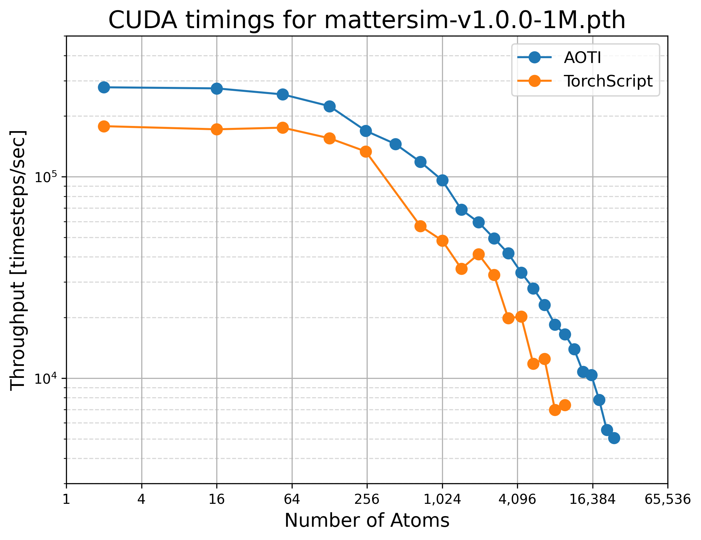

# AOTI MLIP

[](https://github.com/abhijeetgangan/aoti_mlip/actions/workflows/ci.yml)
[](https://codecov.io/gh/abhijeetgangan/aoti_mlip)
[](https://opensource.org/licenses/MIT)
[](https://www.python.org/downloads/)
[](https://pytorch.org/)

Demo of pytorch AOTInductor for uMLIP.

## Installation

### From Source

```bash
git clone https://github.com/abhijeetgangan/aoti_mlip.git
cd aoti_mlip
pip install .
```

## Quick Start

### 1. Compile a Model

Compile a pretrained MatterSim model with aoti. This will store the model with `.pt2` extension:

```python
from aoti_mlip.utils.aoti_compile import compile_mattersim

# Compile the 1M parameter model for CUDA
package_path = compile_mattersim(
    checkpoint_name="mattersim-v1.0.0-1M.pth",
    cutoff=5.0,
    threebody_cutoff=4.0,
    compute_force=True,
    compute_stress=True,
    device="cuda"
)
# Package saved to: ~/.local/mattersim/pretrained_models/mattersim-v1.0.0-1M.pt2
```

The compiled package is **device-specific**.

### 2. Run simulation with ASE

Use the compiled model with ASE for fast calculations:

```python
import torch
from ase.build import bulk
from aoti_mlip.calculators.mattersim import MatterSimCalculator

# Create your atomic structure
atoms = bulk("Fe", "bcc", a=2.86, cubic=True).repeat((3, 3, 3))

# Load the compiled model
calc = MatterSimCalculator(
    model_path="~/.local/mattersim/pretrained_models/mattersim-v1.0.0-1M.pt2",
    device="cuda"
)
atoms.calc = calc

# Calculate properties
energy = atoms.get_potential_energy()
forces = atoms.get_forces()
stress = atoms.get_stress()
```

## Performance

Benchmarks were performed on NVIDIA A100 40GB GPU.

<table>
<tr>
<td width="50%">

</td>
<td width="50%">

</td>
</tr>
</table>

Run `examples/benchmark.py` to generate your own performance plots.

## License and third‑party notices

- Project license: MIT [LICENSE](LICENSE)
- Third‑party: Mattersim v1.2.0 — MIT. See [third_party/mattersim/LICENSE](third_party/mattersim/LICENSE) and upstream at [microsoft/mattersim v1.2.0](https://github.com/microsoft/mattersim/tree/v1.2.0).
- Third‑party: NequIP — MIT. See [third_party/nequip/LICENSE](third_party/nequip/LICENSE) and upstream at [mir-group/nequip](https://github.com/mir-group/nequip).

If any attribution is missing or incorrect, please open an issue or PR.
